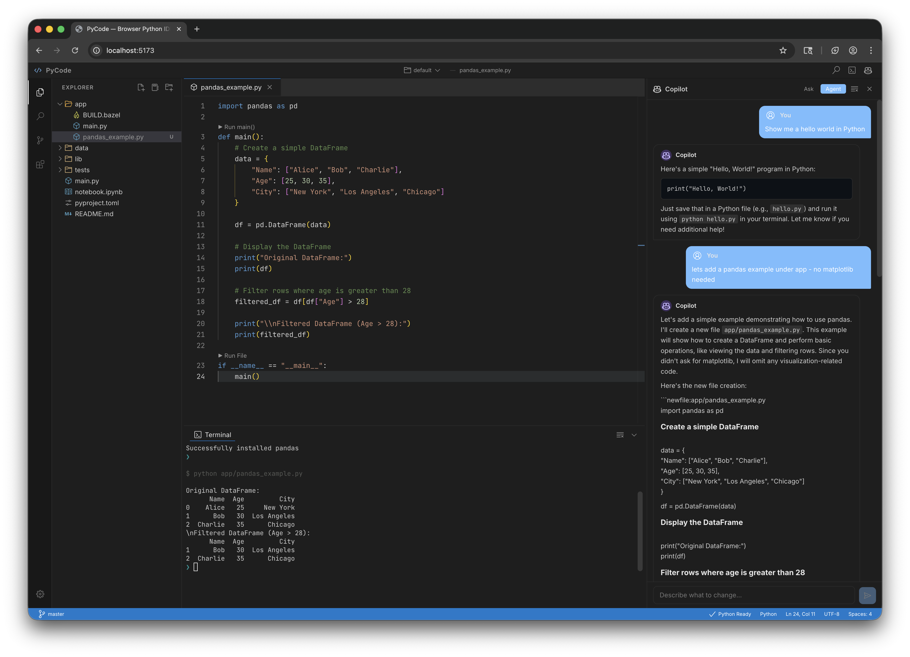
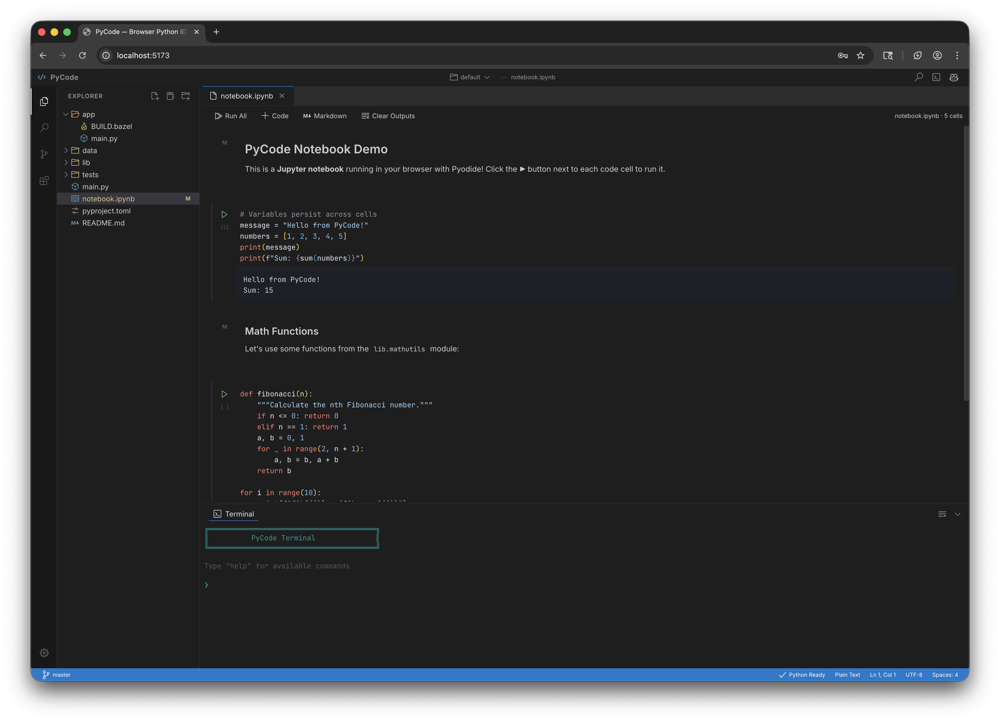

# PyCode

A browser-only Python IDE with AI. No backend, no installation — just open it in a browser.





## Quick Start

```bash
npm install
npm run dev
```

Open [http://localhost:5173](http://localhost:5173).

To build for production:

```bash
npm run build
npx serve dist
```

To open a GitHub repo directly:

```
http://localhost:5173?repo=https://github.com/user/repo
```

## Features

- **Monaco Editor** — Full VS Code editing experience with syntax highlighting, IntelliSense, and multi-tab support
- **Jupyter Notebooks** — Native `.ipynb` editor with per-cell execution, markdown rendering, and cell management (add, delete, move, toggle type)
- **Python Execution** — Run Python files and notebook cells via Pyodide (WebAssembly) — no server required
- **In-Browser Git** — Clone, commit, push, pull, stage, diff — all powered by `isomorphic-git`
- **Command Palette** — VS Code-style quick launcher for files and commands
- **Built-in Terminal** — xterm.js terminal with `python`, `git`, `uv`, and `bazel` commands
- **AI Copilot** — Chat and inline agent mode via GitHub Models API
- **Workspaces** — Isolated environments persisted in IndexedDB
- **Package Management** — Install PyPI packages via Pyodide's micropip

## Workspaces

Each workspace is an isolated environment with its own files and Git history.

- Click the **workspace name** in the titlebar to open the picker
- **+ New Workspace** — creates a fresh, empty workspace
- **🗑 Delete** — hover over a workspace to remove it (can't delete default or active)
- Workspaces persist in IndexedDB across browser sessions

## Terminal Commands

```
python main.py          Run a Python file
clear                   Clear the terminal
ls                      List files
cat <file>              Display file contents
help                    Show available commands

uv sync                 Install workspace dependencies
uv run main.py          Run a file via uv
bazel query //...       List build targets
bazel run //app:app     Run a py_binary

git status              Show changed files
git clone <url>         Clone a repository
git add / commit / log  Stage, commit, view history
git push / pull         Push commits / pull updates
```

## Keyboard Shortcuts

| Shortcut | Action |
|----------|--------|
| `Ctrl+P` | Command palette (file search) |
| `Ctrl+Shift+P` | Command palette (commands) |
| `Ctrl+N` | New file |
| `Ctrl+J` | New notebook |
| `Ctrl+S` | Save file |
| `Ctrl+W` | Close tab |
| `Ctrl+B` | Toggle sidebar |
| `` Ctrl+` `` | Toggle terminal |
| `F5` | Run active Python file |
| `Ctrl+Shift+E` | Explorer panel |
| `Ctrl+Shift+F` | Search panel |
| `Ctrl+Shift+G` | Git panel |

## Copilot

Built-in AI chat panel and inline completions via GitHub Models API.

1. Go to **Settings → GitHub Token** and enter a GitHub PAT (with Models permission)
2. Click the ✨ icon to open the chat
3. **Ask** mode — get answers about your code
4. **Agent** mode — AI proposes targeted file edits you can accept or reject

Models: GPT-4o · GPT-4o Mini · o3-mini

## Architecture

```
src/
├── App.tsx                    # Root component + layout
├── context/AppContext.tsx      # Global state (useReducer)
├── hooks/
│   ├── useResize.ts           # Drag-to-resize panels
│   └── useKeyboard.ts         # Global keyboard shortcuts
├── services/
│   ├── vfs.ts                 # Virtual File System
│   ├── git.ts                 # In-browser Git (isomorphic-git)
│   ├── copilot.ts             # GitHub Models API
│   ├── pyodide.ts             # Python execution (Web Worker)
│   ├── toml.ts                # TOML parser
│   ├── uv.ts                  # UV workspace analysis
│   └── bazel.ts               # Bazel BUILD parser
└── components/
    ├── TitleBar/               # App branding + workspace picker
    ├── ActivityBar/            # Sidebar navigation icons
    ├── Sidebar/                # Explorer, Search, Git, Settings
    ├── Editor/                 # Monaco Editor, Notebook Editor, tabs
    ├── Terminal/               # xterm.js terminal
    ├── CommandPalette/         # Ctrl+P / Ctrl+Shift+P launcher
    ├── Copilot/                # AI chat panel
    ├── StatusBar/              # Git branch, language, cursor
    ├── Dialog/                 # Prompt and confirm modals
    ├── Notification/           # Toast notifications
    ├── ContextMenu/            # Right-click menus
    └── shared/                 # Reusable UI primitives
```

## Tech Stack

**React 19** · **TypeScript** · **Vite** ·
[Monaco Editor](https://github.com/microsoft/monaco-editor) ·
[Pyodide](https://github.com/pyodide/pyodide) ·
[xterm.js](https://github.com/xtermjs/xterm.js) ·
[isomorphic-git](https://github.com/isomorphic-git/isomorphic-git) ·
[LightningFS](https://github.com/isomorphic-git/lightning-fs)

All dependencies bundled via npm. Zero backend required.

## Limitations

- **Browser sandbox** — No access to your local filesystem, native processes, or system Python. Everything runs inside the browser.
- **Pyodide, not CPython** — Python runs via WebAssembly (Pyodide). C extensions that aren't pre-compiled for Pyodide won't work (`numpy`, `pandas`, `scikit-learn` do work).
- **No real pip** — `pip install` uses Pyodide's micropip, which pulls from PyPI but only supports pure-Python wheels and Pyodide-built packages.
- **Simulated uv/bazel** — `uv` and `bazel` commands are simulated interpretations of config files, not the real tools.
- **Git clone/push limitations** — Git uses `isomorphic-git` in-browser, which requires the remote to support CORS. Public GitHub repos work. Push requires a PAT with `Contents: Read and write` permission.
- **No multi-file debugging** — No breakpoints, debugger, or step-through. Use `print()`.
- **Storage is IndexedDB** — Files persist in the browser's IndexedDB. Clearing site data erases everything.
- **Copilot requires a PAT** — The GitHub PAT is stored in `localStorage` (not encrypted). Use a fine-grained token with minimal permissions.
