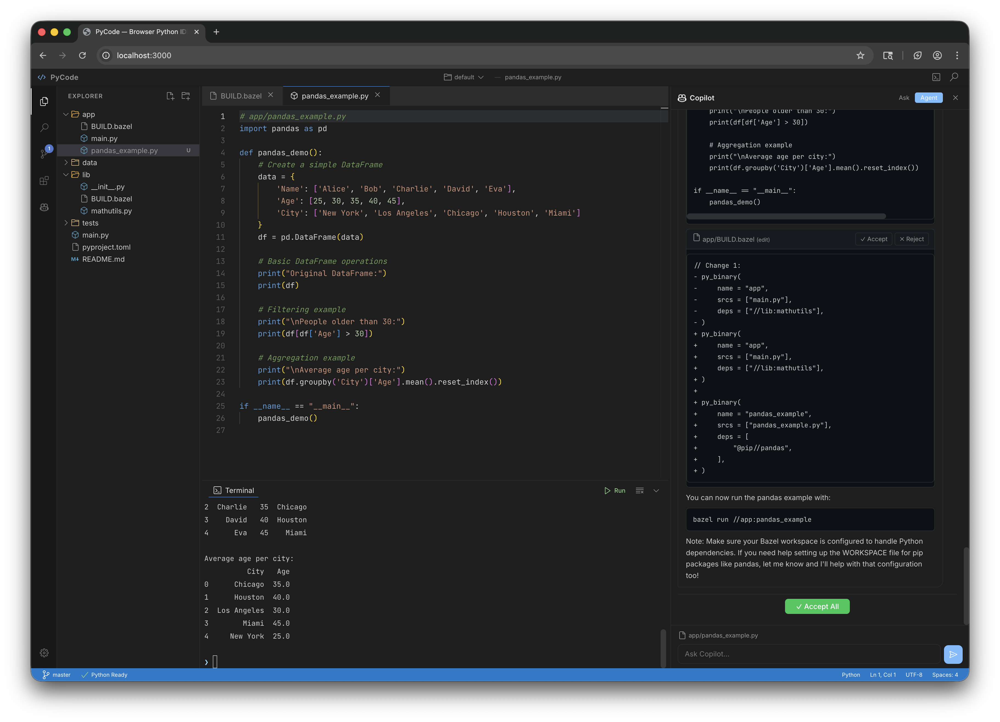

# PyCode

A browser-only Python IDE with AI. No backend, no installation — just open it in a browser.



## Quick Start

```bash
npx serve .
# or
python3 -m http.server 3000
```

Open [http://localhost:3000](http://localhost:3000).

To open a GitHub repo directly:

```
http://localhost:3000?repo=https://github.com/user/repo
```

This auto-creates a workspace named after the repo.

## Workspaces

Each workspace is an isolated environment with its own files and Git history.

- Click the **workspace name** in the titlebar to open the picker
- **+ New Workspace** — creates a fresh, empty workspace
- **🗑 Delete** — hover over a workspace to remove it (can't delete default or active)
- Workspaces persist in IndexedDB across browser sessions

## Terminal Commands

```
python main.py          Run a Python file
pip install numpy       Install a PyPI package

uv sync                 Install workspace dependencies
uv run main.py          Run a file via uv
bazel query //...       List build targets
bazel run //app:app     Run a py_binary
bazel test //pkg:tgt    Run a py_test

git status              Show changed files
git clone <url>         Clone a repository
git add / commit / log  Stage, commit, view history
git push / pull         Push commits / pull updates
```

## Copilot

Built-in AI chat panel and inline completions via GitHub Models API.

1. Go to **Settings → Copilot** and enter a GitHub PAT (with Models permission)
2. Click the ✨ icon in the activity bar to open the chat
3. **Ask** mode — get answers about your code
4. **Agent** mode — AI proposes targeted file edits you can accept or reject
5. Inline ghost-text completions appear as you type

Models: GPT-4o · GPT-4o Mini · o3-mini · Mistral Large · DeepSeek R1

## Architecture

Five files, zero build tools:

| File | Purpose |
|---|---|
| `index.html` | App shell, CDN imports |
| `styles.css` | VS Code dark theme |
| `app.js` | Editor, terminal, file explorer, Copilot, uv/bazel |
| `git.js` | In-browser Git (isomorphic-git) |
| `pyodide-worker.js` | Python execution in a Web Worker |

## Tech Stack

[Monaco Editor](https://github.com/microsoft/monaco-editor) ·
[Pyodide](https://github.com/pyodide/pyodide) ·
[xterm.js](https://github.com/xtermjs/xterm.js) ·
[isomorphic-git](https://github.com/isomorphic-git/isomorphic-git) ·
[LightningFS](https://github.com/nicolo-ribaudo/isomorphic-git-lightning-fs)

All loaded from CDN — nothing to install.

## Limitations

- **Browser sandbox** — No access to your local filesystem, native processes, or system Python. Everything runs inside the browser.
- **Pyodide, not CPython** — Python runs via WebAssembly (Pyodide). C extensions that aren't pre-compiled for Pyodide won't work (`numpy`, `pandas`, `scikit-learn` do work).
- **No real pip** — `pip install` uses Pyodide's micropip, which pulls from PyPI but only supports pure-Python wheels and Pyodide-built packages.
- **Simulated uv/bazel** — `uv` and `bazel` commands are simulated interpretations of config files, not the real tools. They won't run arbitrary build rules.
- **Git clone/push limitations** — Git uses `isomorphic-git` in-browser, which requires the remote to support CORS. Public GitHub repos work. Push requires a PAT with `Contents: Read and write` permission.
- **No multi-file debugging** — No breakpoints, debugger, or step-through. Use `print()`.
- **Storage is IndexedDB** — Files persist in the browser's IndexedDB. Clearing site data erases everything. There is no cloud sync.
- **Copilot requires a PAT** — The GitHub PAT is stored in `localStorage` (not encrypted). Use a fine-grained token with minimal permissions.
